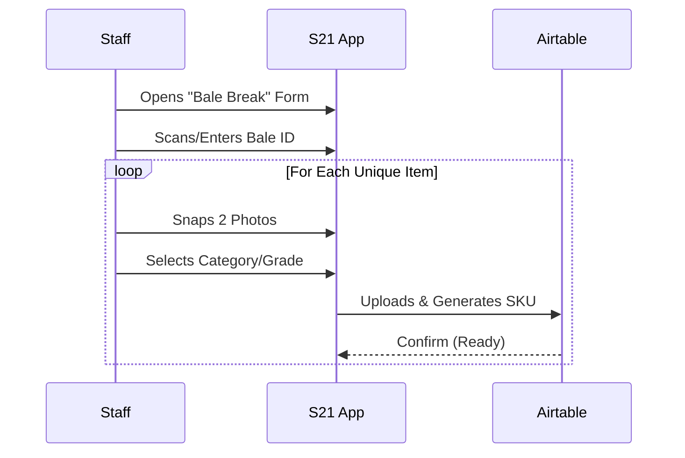
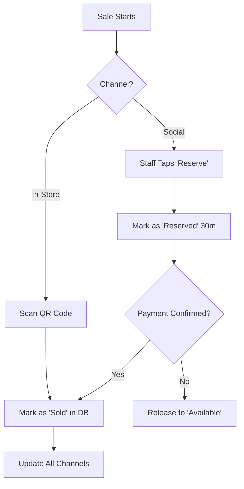
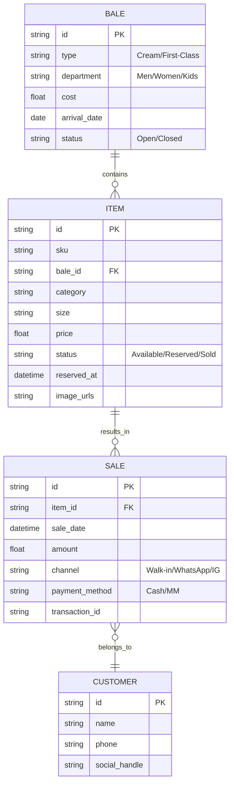

# Technical Blueprint: The Cream Collective

## Overview
This document outlines the technical architecture for **The Cream Collective**, a premium curated fashion boutique in Kampala. The system is designed to be mobile-first, lean, and managed entirely from a smartphone (Samsung S21).

---

## 1. High-Speed Unique-SKU Cataloging
Since every item is a one-of-a-kind (unique SKU), the cataloging process must be extremely efficient to minimize "Time to Catalog".

### Workflow: Bale-to-Live
1. **Bale Intake**: Staff logs a new bale (e.g., "Cream Bale - Women's Dresses") with cost and date.
2. **Rapid Capture**:
   - Staff uses a mobile form to snap 2-3 photos.
   - Selects category (Dress, T-shirt, etc.) from a preset list.
   - Price is auto-suggested based on Category + Bale Grade.
3. **Automated SKU**: System generates a SKU: `[BaleID]-[ShortCategory]-[Sequence]` (e.g., `B01-DRS-001`).
4. **Instant Listing**: Item is immediately available in the internal inventory and can be shared to social channels via a "Share to Instagram/WhatsApp" button.

---

## 2. Real-Time Multi-Channel Synchronization
To prevent **Double-Sell Incidents**, the Inventory is the Single Source of Truth (SSOT).

### Channel Sync Logic:
- **In-Store**: Staff uses the POS app to scan the item's QR code and mark as sold.
- **Social Media (IG/TikTok/WhatsApp)**: 
  - Staff shares a unique link to the item.
  - When a customer says "I want this", staff taps **"Reserve"** in the app.
  - **Reservation Lock**: The item becomes "Reserved" for 30 minutes. It disappears from the "Available" list for other staff/customers.
  - If payment is not confirmed within 30 minutes, the lock expires and the item returns to "Available".

### Sync Logic: Webhooks vs Polling vs Events
- **Event-Driven (Internal)**: Immediate state updates between Glide and Airtable.
- **Webhooks (Payments)**: Payment gateways (Flutterwave/Paystack) notify the system instantly upon successful Mobile Money transaction.
- **Polling (Fallback)**: Used only for automated cleanup of expired reservations.

---

## 3. Mobile-First POS & Mobile Money Workflow
The POS is a web-based mobile app optimized for the S21.

### Payment Data Flow:
1. **Initiate Sale**: Staff selects "Mobile Money" at checkout.
2. **STK Push (MTN/Airtel)**: Staff enters customer's phone number.
3. **Customer PIN**: Customer receives a prompt on their phone to enter their MM PIN.
4. **Verification**: 
   - **Automatic**: API callback (Webhook) updates the sale status to "Paid".
   - **Manual Fallback**: Staff enters the MM Transaction ID if the automatic sync fails.
5. **Receipt**: A digital receipt is generated and sent via WhatsApp.

---

## 4. Data-Driven Insights
The system tracks KPIs automatically to guide purchasing:
- **Inventory Turnover Rate**: Average days to sell by bale type and department.
- **Margin per Bale**: Net profit after all items in a specific bale are sold.
- **Social-to-Sale Conversion**: Which channel (WhatsApp vs IG) has the highest conversion rate.

---

## 5. Practical Tech Stack Options (Comparative)

| Feature | **Option 1: Low-Code (Glide + Airtable)** | **Option 2: Shopify (Mobile)** | **Option 3: Custom (Node + Turso)** |
|:--- |:--- |:--- |:--- |
| **Cost (Monthly)** | ~$50 - $100 | $39 + App Fees | ~$20 (Hosting) |
| **Mobile Friendliness**| **Native-feel (Best)** | Responsive Web | Custom |
| **Learning Curve** | Very Low | Medium | High |
| **Real-Time Sync** | Excellent | Good | Custom |
| **Offline Capability** | Basic (Caching) | Limited | Full (PWA) |
| **Unique SKU Mgmt** | **High (Customizable)** | Low (Tedious) | High |

**Recommendation**: **Option 1 (Glide + Airtable)** is the strongest fit for Kampala. It allows a custom "Bale Break" interface that works perfectly on an S21, handles the unique SKU requirement better than standard e-commerce platforms, and integrates easily with local payment APIs via Make.com.

---

## 6. Network Reliability & Offline Strategy
- **Optimistic UI**: Queues local updates during brief network drops.
- **Manual Sync Recovery**: A "Check Payment Status" button allows staff to manually re-trigger a webhook check if the network was down during a transaction.
- **Image Compression**: Auto-resize on-device before upload to save data.

---

## 7. Data Flow Diagrams

### Workflow: Bale Breaking to Listing


### Workflow: Multi-Channel Sale Sync


---

## 8. Entity-Relationship Diagram (ERD)



---

## 9. Database Schema (SQL DDL)

```sql
CREATE TABLE bales (
    id UUID PRIMARY KEY DEFAULT gen_random_uuid(),
    bale_type TEXT CHECK (bale_type IN ('Cream', 'First-Class')),
    department TEXT CHECK (department IN ('Men', 'Women', 'Kids')),
    cost DECIMAL(12, 2),
    arrival_date DATE DEFAULT CURRENT_DATE,
    status TEXT DEFAULT 'Open'
);

CREATE TABLE items (
    id UUID PRIMARY KEY DEFAULT gen_random_uuid(),
    sku TEXT UNIQUE NOT NULL,
    bale_id UUID REFERENCES bales(id),
    category TEXT,
    size TEXT,
    price DECIMAL(12, 2),
    status TEXT DEFAULT 'Available' CHECK (status IN ('Available', 'Reserved', 'Sold')),
    reserved_at TIMESTAMP,
    image_urls TEXT[],
    created_at TIMESTAMP DEFAULT NOW()
);

CREATE TABLE sales (
    id UUID PRIMARY KEY DEFAULT gen_random_uuid(),
    item_id UUID REFERENCES items(id),
    sale_date TIMESTAMP DEFAULT NOW(),
    amount DECIMAL(12, 2),
    channel TEXT CHECK (channel IN ('Walk-in', 'WhatsApp', 'Instagram', 'TikTok')),
    payment_method TEXT CHECK (payment_method IN ('Cash', 'Mobile Money')),
    transaction_id TEXT,
    customer_phone TEXT
);
```
